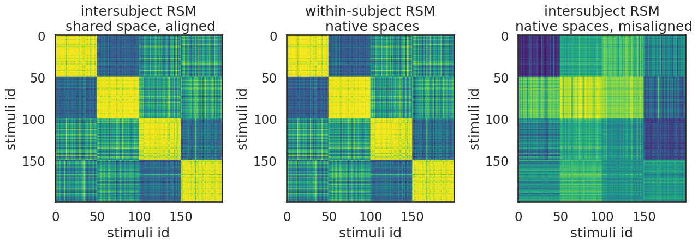

# nnsrm-pytorch

Modern replication of "Shared Representational Geometry Across Neural Networks", NeurIPS 2018



All credits to the original authors at https://github.com/qihongl/demo-nnalign and https://github.com/qihongl/nnsrm-neurips18. Any mistakes introduced are those of my own.

Original citation:
```
Lu, Q., Chen, P.-H., Pillow, J. W., Ramadge, P. J., Norman, K. A., & Hasson, U. (2018). 
Shared Representational Geometry Across Neural Networks. arXiv [cs.LG]. 
Retrieved from http://arxiv.org/abs/1811.11684
```

## Demo notebook

`demo/demo-nnalign-reimplemented.ipynb` is a re-implementation of the tutorial notebook in https://github.com/qihongl/demo-nnalign

At the end of the notebook, you should see the plot in the README header. The plot  explained in plain english:
- right: activations of two different networks trained on the same data being misaligned in their own activation space
- middle: mean representational similarity matrix across both networks' activations, measured by calculating correlation of each network's activations with itself
- left: activations of two different networks trained on the same data, but aligned into the same shared space using the shared response model from neuroscience. Notice how with SRM alignment, both network's activations in this subplot exhibit a similar correlation map with the middle subplot.

Changes made: Replaced keras and supporting libraries with Pytorch, pulled just the SRM code from Brainiak and replaced the MPI bits to sidestep installing OpenMPI.

## Main repo

WIP


